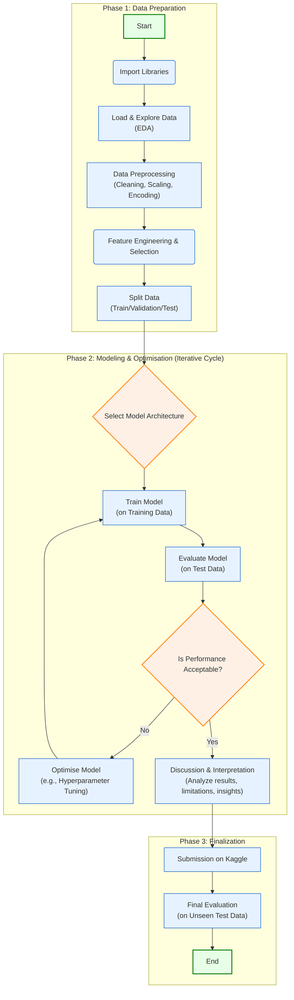

# machine-learning-2526

## Proposed workflow 

```mermaid
graph TD
    subgraph "Phase 1: Data Preparation"
        A[Start] --> B(Import Libraries);
        B --> C["Load & Explore Data\n(EDA)"];
        C --> D["Data Preprocessing\n(Cleaning, Scaling, Encoding)"];
        D --> E(Feature Engineering & Selection);
        E --> F["Split Data\n(Train/Validation/Test)"];
    end

    subgraph "Phase 2: Modeling & Optimisation (Iterative Cycle)"
        F --> G{Select Model Architecture};
        G --> H["Train Model\n(on Training Data)"];
        H --> I["Evaluate Model\n(on Test Data)"];
        I --> J{Is Performance Acceptable?};
        J -- No --> K["Optimise Model\n(e.g., Hyperparameter Tuning)"];
        K --> H;
        J -- Yes --> L["Discussion & Interpretation\n(Analyze results, limitations, insights)"];
    end

    subgraph "Phase 3: Finalization"
        L --> M[Submission on Kaggle];
        M --> N["Final Evaluation\n(on Unseen Test Data)"];
        N --> O[End];
    end

    %% Styling for better visual clarity (may not be fully supported on GitHub)
    classDef phase fill:#f9f9f9,stroke:#333,stroke-width:2px;
    classDef decision fill:#fff0e6,stroke:#ff8c1a,stroke-width:2px;
    classDef startend fill:#e6ffe6,stroke:#008000,stroke-width:2px;
    classDef process fill:#e6f2ff,stroke:#0055cc,stroke-width:1px;

    class A,O startend;
    class G,J decision;
    class B,C,D,E,F,H,I,K,L,M,N process;
```
