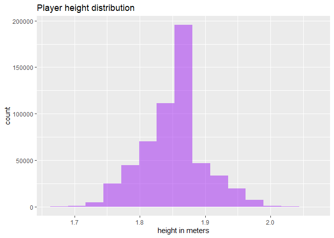

# machine learning: EDA
Reinout Schols

## Loading packages

``` r
library(tidyverse)
library(data.table)
library(ggplot2)
library(arrow)   # Optional: for fast reading if using parquet/csv.gz
library(gganimate)
library(ggplot2)
library(factoextra)
library(glmnet) 
library(gt)
library(gridExtra)
```

## Data prep

``` r
# -------------------------------
# 1. Define data directories
# -------------------------------
data_dir <- "C:/machine learning/train"

input_files <- list.files(data_dir, pattern = "input_.*\\.csv", full.names = TRUE)
output_files <- list.files(data_dir, pattern = "output_.*\\.csv", full.names = TRUE)

cat("Found", length(input_files), "input files and", length(output_files), "output files.\n")
```

    Found 18 input files and 18 output files.

``` r
# -------------------------------
# 2. Load and combine CSVs using data.table for speed
# -------------------------------
input_data <- rbindlist(lapply(input_files, fread), use.names = TRUE)
output_data <- rbindlist(lapply(output_files, fread), use.names = TRUE)

cat("Input shape:", dim(input_data), "\n")
```

    Input shape: 4880579 23 

``` r
cat("Output shape:", dim(output_data), "\n")
```

    Output shape: 562936 6 

``` r
# -------------------------------
# 3. Filter only players to predict
# -------------------------------
input_filtered <- input_data[player_to_predict == TRUE]
cat("Filtered input shape:", dim(input_filtered), "\n")
```

    Filtered input shape: 1303440 23 

``` r
# -------------------------------
# 4. Merge input and output
# -------------------------------
merged_data <- merge(
  input_filtered,
  output_data,
  by = c("game_id", "play_id", "nfl_id", "frame_id"),
  suffixes = c("_input", "_output")
)
cat("Merged data shape:", dim(merged_data), "\n")
```

    Merged data shape: 560426 25 

``` r
# -------------------------------
# 5. Convert height from "6-1" to inches
# -------------------------------
height_to_inches <- function(height_str) {
  sapply(height_str, function(h) {
    if (!is.na(h) && grepl("-", h)) {
      parts <- strsplit(h, "-")[[1]]
      as.numeric(parts[1]) * 12 + as.numeric(parts[2])
    } else {
      NA
    }
  })
}

merged_data[, player_height := height_to_inches(player_height)]

# -------------------------------
# 6. Encode play_direction
# -------------------------------
merged_data[, play_direction_encoded := as.integer(play_direction == "right")]

# -------------------------------
# 7. One-hot encode categorical variables
# -------------------------------
# player_position
position_dummies <- as.data.table(model.matrix(~ player_position - 1, merged_data))
# player_role
role_dummies <- as.data.table(model.matrix(~ player_role - 1, merged_data))

# Bind one-hot columns
merged_data <- cbind(merged_data, position_dummies, role_dummies)

# -------------------------------
# 8. Compute BMI
# -------------------------------
merged_data[, bmi := (player_weight / (player_height^2)) * 703]

# -------------------------------
# 9. Select features and target
# -------------------------------
feature_columns <- c(
  'absolute_yardline_number', 'player_height', 'player_weight',
  'x_input', 'y_input', 's', 'a', 'dir', 'o',
  'num_frames_output', 'ball_land_x', 'ball_land_y', 'bmi',
  'play_direction_encoded'
)

feature_columns <- c(feature_columns, colnames(position_dummies), colnames(role_dummies))

X <- merged_data[, ..feature_columns]
y_x <- merged_data$x_output
y_y <- merged_data$y_output

cat("Features shape:", dim(X), "\n")
```

    Features shape: 560426 33 

``` r
cat("Target X shape:", length(y_x), "\n")
```

    Target X shape: 560426 

``` r
cat("Target Y shape:", length(y_y), "\n")
```

    Target Y shape: 560426 

``` r
# -------------------------------
# 10. Save preprocessed data to Parquet for fast reload
# -------------------------------
write_parquet(merged_data, "cleaned_nfl_merged.parquet")
write_parquet(as.data.table(X), "cleaned_nfl_features.parquet")
write_parquet(data.table(x_output = y_x, y_output = y_y), "cleaned_nfl_targets.parquet")

cat("Preprocessing complete. Files saved as Parquet.\n")
```

    Preprocessing complete. Files saved as Parquet.

## Feature engineering

``` r
merged_data[, player_age := as.numeric(difftime(Sys.Date(), as.Date(player_birth_date), units="days")) / 365.25]

# Height in meters
merged_data[, player_height_m := player_height * 0.0254]

# Weight in kg
merged_data[, player_weight_kg := player_weight * 0.453592]

# Coordinates in meters
coords <- c("x_input", "y_input", "ball_land_x", "ball_land_y")
for (col in coords) {
  merged_data[, (paste0(col, "_m")) := get(col) * 0.9144]
}

# Speed and acceleration in m/s and m/s²
merged_data[, s_mps := s * 0.9144]
merged_data[, a_mps2 := a * 0.9144]

# Distance to ball (meters)
merged_data[, dist_to_ball_m := sqrt((x_input_m - ball_land_x_m)^2 + (y_input_m - ball_land_y_m)^2)]

# Kinetic energy (Joules)
merged_data[, kinetic_energy := 0.5 * player_weight_kg * s_mps^2]

merged_data[, dist_to_sideline := pmin(y_input_m, 48.8 - y_input_m)]
merged_data[, dist_to_endzone := 109.7 - x_input_m]  # assuming offense moving right
```

## Data exploration (simple histograms)

``` r
dim(merged_data)
```

    [1] 560426     59

``` r
ggplot(merged_data, aes(x = s_mps)) + 
  geom_histogram(bins = 50, fill = "blue", alpha = 0.5) + 
  labs(title = "Player Speed Distribution", x = "Speed (M/S)")
```


``` r
ggplot(merged_data, aes(x = a_mps2)) + 
  geom_histogram(bins = 50, fill = "red", alpha = 0.5) + 
  labs(title = "Player Acceleration Distribution", x = "Acceleration (m/s^2)")
```


``` r
ggplot(merged_data, aes(x = player_weight_kg)) + 
  geom_histogram(bins = 50, fill = "green", alpha = 0.5) + 
  labs(title = "Player mass distribution", x = "mass (kg)")
```


``` r
ggplot(merged_data, aes(x = player_age)) + 
  geom_histogram(bins = 50, fill = "darkorange", alpha = 0.5) + 
  labs(title = "Player age distribution", x = "age")
```


``` r
ggplot(merged_data, aes(x = player_height_m)) + 
  geom_histogram(bins = 15, fill = "purple", alpha = 0.5) + 
  labs(title = "Player height distribution", x = "height in meters")
```



``` r
ggplot(merged_data, aes(x = kinetic_energy)) + 
  geom_histogram(bins = 15, fill = "purple", alpha = 0.5) + 
  labs(title = "Player kinetic energy distribution", x = "kinetic energy (Joules)")
```


# Data exploration (PCA)

## Running PCA and plotting screeplot

``` r
pca_features <- cbind(
  merged_data[, .(x_input_m, y_input_m, s_mps, a_mps2, dir, o,
                  dist_to_ball_m, kinetic_energy,
                  ball_land_x_m, ball_land_y_m, player_height_m,
                  player_weight_kg, bmi, player_age,
                  absolute_yardline_number, dist_to_sideline, dist_to_endzone)]
)

pca_scaled <- scale(pca_features)
pca_res <- princomp(pca_scaled)
pca_sum <- summary(pca_res)
fviz_eig(pca_res, addlabels = TRUE, ylim = c(0, 50))
```


## Creating table for principal component loadings

``` r
var_explained <- pca_res$sdev^2 / sum(pca_res$sdev^2) 
cum_var <- cumsum(var_explained)                       

# Make tibble
tibble_pca <- tibble(
  PC = paste0("PC", 1:length(var_explained)),
  `Variance Explained` = var_explained,
  `Cumulative Variance` = cum_var
) %>%
  mutate(
    `Variance Explained` = round(`Variance Explained`, 3),
    `Cumulative Variance` = round(`Cumulative Variance`, 3)
  )

# Make nice gt table
tibble_pca %>% slice_head(n = 10) %>%
  gt() %>%
  tab_header(title = "Proportion of Variance Explained per component") %>%
  fmt_percent(columns = c(`Variance Explained`, `Cumulative Variance`), decimals = 1) %>%
  opt_stylize(style = 3) %>% tab_style(
    style = list(cell_fill(color = "lightblue")),
    locations = cells_body(rows = 1:5)
  )
```

<div>

<div id="epkzackeso" style="padding-left:0px;padding-right:0px;padding-top:10px;padding-bottom:10px;overflow-x:auto;overflow-y:auto;width:auto;height:auto;">
<style>#epkzackeso table {
  font-family: system-ui, 'Segoe UI', Roboto, Helvetica, Arial, sans-serif, 'Apple Color Emoji', 'Segoe UI Emoji', 'Segoe UI Symbol', 'Noto Color Emoji';
  -webkit-font-smoothing: antialiased;
  -moz-osx-font-smoothing: grayscale;
}
&#10;#epkzackeso thead, #epkzackeso tbody, #epkzackeso tfoot, #epkzackeso tr, #epkzackeso td, #epkzackeso th {
  border-style: none;
}
&#10;#epkzackeso p {
  margin: 0;
  padding: 0;
}
&#10;#epkzackeso .gt_table {
  display: table;
  border-collapse: collapse;
  line-height: normal;
  margin-left: auto;
  margin-right: auto;
  color: #333333;
  font-size: 16px;
  font-weight: normal;
  font-style: normal;
  background-color: #FFFFFF;
  width: auto;
  border-top-style: solid;
  border-top-width: 2px;
  border-top-color: #929292;
  border-right-style: none;
  border-right-width: 2px;
  border-right-color: #D3D3D3;
  border-bottom-style: solid;
  border-bottom-width: 2px;
  border-bottom-color: #929292;
  border-left-style: none;
  border-left-width: 2px;
  border-left-color: #D3D3D3;
}
&#10;#epkzackeso .gt_caption {
  padding-top: 4px;
  padding-bottom: 4px;
}
&#10;#epkzackeso .gt_title {
  color: #333333;
  font-size: 125%;
  font-weight: initial;
  padding-top: 4px;
  padding-bottom: 4px;
  padding-left: 5px;
  padding-right: 5px;
  border-bottom-color: #FFFFFF;
  border-bottom-width: 0;
}
&#10;#epkzackeso .gt_subtitle {
  color: #333333;
  font-size: 85%;
  font-weight: initial;
  padding-top: 3px;
  padding-bottom: 5px;
  padding-left: 5px;
  padding-right: 5px;
  border-top-color: #FFFFFF;
  border-top-width: 0;
}
&#10;#epkzackeso .gt_heading {
  background-color: #FFFFFF;
  text-align: center;
  border-bottom-color: #FFFFFF;
  border-left-style: none;
  border-left-width: 1px;
  border-left-color: #D3D3D3;
  border-right-style: none;
  border-right-width: 1px;
  border-right-color: #D3D3D3;
}
&#10;#epkzackeso .gt_bottom_border {
  border-bottom-style: solid;
  border-bottom-width: 2px;
  border-bottom-color: #929292;
}
&#10;#epkzackeso .gt_col_headings {
  border-top-style: solid;
  border-top-width: 2px;
  border-top-color: #929292;
  border-bottom-style: solid;
  border-bottom-width: 2px;
  border-bottom-color: #929292;
  border-left-style: none;
  border-left-width: 1px;
  border-left-color: #D3D3D3;
  border-right-style: none;
  border-right-width: 1px;
  border-right-color: #D3D3D3;
}
&#10;#epkzackeso .gt_col_heading {
  color: #FFFFFF;
  background-color: #004D80;
  font-size: 100%;
  font-weight: normal;
  text-transform: inherit;
  border-left-style: none;
  border-left-width: 1px;
  border-left-color: #D3D3D3;
  border-right-style: none;
  border-right-width: 1px;
  border-right-color: #D3D3D3;
  vertical-align: bottom;
  padding-top: 5px;
  padding-bottom: 6px;
  padding-left: 5px;
  padding-right: 5px;
  overflow-x: hidden;
}
&#10;#epkzackeso .gt_column_spanner_outer {
  color: #FFFFFF;
  background-color: #004D80;
  font-size: 100%;
  font-weight: normal;
  text-transform: inherit;
  padding-top: 0;
  padding-bottom: 0;
  padding-left: 4px;
  padding-right: 4px;
}
&#10;#epkzackeso .gt_column_spanner_outer:first-child {
  padding-left: 0;
}
&#10;#epkzackeso .gt_column_spanner_outer:last-child {
  padding-right: 0;
}
&#10;#epkzackeso .gt_column_spanner {
  border-bottom-style: solid;
  border-bottom-width: 2px;
  border-bottom-color: #929292;
  vertical-align: bottom;
  padding-top: 5px;
  padding-bottom: 5px;
  overflow-x: hidden;
  display: inline-block;
  width: 100%;
}
&#10;#epkzackeso .gt_spanner_row {
  border-bottom-style: hidden;
}
&#10;#epkzackeso .gt_group_heading {
  padding-top: 8px;
  padding-bottom: 8px;
  padding-left: 5px;
  padding-right: 5px;
  color: #333333;
  background-color: #FFFFFF;
  font-size: 100%;
  font-weight: initial;
  text-transform: inherit;
  border-top-style: solid;
  border-top-width: 2px;
  border-top-color: #929292;
  border-bottom-style: solid;
  border-bottom-width: 2px;
  border-bottom-color: #929292;
  border-left-style: none;
  border-left-width: 1px;
  border-left-color: #D3D3D3;
  border-right-style: none;
  border-right-width: 1px;
  border-right-color: #D3D3D3;
  vertical-align: middle;
  text-align: left;
}
&#10;#epkzackeso .gt_empty_group_heading {
  padding: 0.5px;
  color: #333333;
  background-color: #FFFFFF;
  font-size: 100%;
  font-weight: initial;
  border-top-style: solid;
  border-top-width: 2px;
  border-top-color: #929292;
  border-bottom-style: solid;
  border-bottom-width: 2px;
  border-bottom-color: #929292;
  vertical-align: middle;
}
&#10;#epkzackeso .gt_from_md > :first-child {
  margin-top: 0;
}
&#10;#epkzackeso .gt_from_md > :last-child {
  margin-bottom: 0;
}
&#10;#epkzackeso .gt_row {
  padding-top: 8px;
  padding-bottom: 8px;
  padding-left: 5px;
  padding-right: 5px;
  margin: 10px;
  border-top-style: dashed;
  border-top-width: 1px;
  border-top-color: #929292;
  border-left-style: none;
  border-left-width: 1px;
  border-left-color: #929292;
  border-right-style: none;
  border-right-width: 1px;
  border-right-color: #929292;
  vertical-align: middle;
  overflow-x: hidden;
}
&#10;#epkzackeso .gt_stub {
  color: #333333;
  background-color: #D5D5D5;
  font-size: 100%;
  font-weight: initial;
  text-transform: inherit;
  border-right-style: none;
  border-right-width: 2px;
  border-right-color: #FFFFFF;
  padding-left: 5px;
  padding-right: 5px;
}
&#10;#epkzackeso .gt_stub_row_group {
  color: #333333;
  background-color: #FFFFFF;
  font-size: 100%;
  font-weight: initial;
  text-transform: inherit;
  border-right-style: solid;
  border-right-width: 2px;
  border-right-color: #D3D3D3;
  padding-left: 5px;
  padding-right: 5px;
  vertical-align: top;
}
&#10;#epkzackeso .gt_row_group_first td {
  border-top-width: 2px;
}
&#10;#epkzackeso .gt_row_group_first th {
  border-top-width: 2px;
}
&#10;#epkzackeso .gt_summary_row {
  color: #333333;
  background-color: #FFFFFF;
  text-transform: inherit;
  padding-top: 8px;
  padding-bottom: 8px;
  padding-left: 5px;
  padding-right: 5px;
}
&#10;#epkzackeso .gt_first_summary_row {
  border-top-style: solid;
  border-top-color: #929292;
}
&#10;#epkzackeso .gt_first_summary_row.thick {
  border-top-width: 2px;
}
&#10;#epkzackeso .gt_last_summary_row {
  padding-top: 8px;
  padding-bottom: 8px;
  padding-left: 5px;
  padding-right: 5px;
  border-bottom-style: solid;
  border-bottom-width: 2px;
  border-bottom-color: #929292;
}
&#10;#epkzackeso .gt_grand_summary_row {
  color: #333333;
  background-color: #D5D5D5;
  text-transform: inherit;
  padding-top: 8px;
  padding-bottom: 8px;
  padding-left: 5px;
  padding-right: 5px;
}
&#10;#epkzackeso .gt_first_grand_summary_row {
  padding-top: 8px;
  padding-bottom: 8px;
  padding-left: 5px;
  padding-right: 5px;
  border-top-style: double;
  border-top-width: 6px;
  border-top-color: #929292;
}
&#10;#epkzackeso .gt_last_grand_summary_row_top {
  padding-top: 8px;
  padding-bottom: 8px;
  padding-left: 5px;
  padding-right: 5px;
  border-bottom-style: double;
  border-bottom-width: 6px;
  border-bottom-color: #929292;
}
&#10;#epkzackeso .gt_striped {
  background-color: #F4F4F4;
}
&#10;#epkzackeso .gt_table_body {
  border-top-style: solid;
  border-top-width: 2px;
  border-top-color: #929292;
  border-bottom-style: solid;
  border-bottom-width: 2px;
  border-bottom-color: #929292;
}
&#10;#epkzackeso .gt_footnotes {
  color: #333333;
  background-color: #FFFFFF;
  border-bottom-style: none;
  border-bottom-width: 2px;
  border-bottom-color: #D3D3D3;
  border-left-style: none;
  border-left-width: 2px;
  border-left-color: #D3D3D3;
  border-right-style: none;
  border-right-width: 2px;
  border-right-color: #D3D3D3;
}
&#10;#epkzackeso .gt_footnote {
  margin: 0px;
  font-size: 90%;
  padding-top: 4px;
  padding-bottom: 4px;
  padding-left: 5px;
  padding-right: 5px;
}
&#10;#epkzackeso .gt_sourcenotes {
  color: #333333;
  background-color: #FFFFFF;
  border-bottom-style: none;
  border-bottom-width: 2px;
  border-bottom-color: #D3D3D3;
  border-left-style: none;
  border-left-width: 2px;
  border-left-color: #D3D3D3;
  border-right-style: none;
  border-right-width: 2px;
  border-right-color: #D3D3D3;
}
&#10;#epkzackeso .gt_sourcenote {
  font-size: 90%;
  padding-top: 4px;
  padding-bottom: 4px;
  padding-left: 5px;
  padding-right: 5px;
}
&#10;#epkzackeso .gt_left {
  text-align: left;
}
&#10;#epkzackeso .gt_center {
  text-align: center;
}
&#10;#epkzackeso .gt_right {
  text-align: right;
  font-variant-numeric: tabular-nums;
}
&#10;#epkzackeso .gt_font_normal {
  font-weight: normal;
}
&#10;#epkzackeso .gt_font_bold {
  font-weight: bold;
}
&#10;#epkzackeso .gt_font_italic {
  font-style: italic;
}
&#10;#epkzackeso .gt_super {
  font-size: 65%;
}
&#10;#epkzackeso .gt_footnote_marks {
  font-size: 75%;
  vertical-align: 0.4em;
  position: initial;
}
&#10;#epkzackeso .gt_asterisk {
  font-size: 100%;
  vertical-align: 0;
}
&#10;#epkzackeso .gt_indent_1 {
  text-indent: 5px;
}
&#10;#epkzackeso .gt_indent_2 {
  text-indent: 10px;
}
&#10;#epkzackeso .gt_indent_3 {
  text-indent: 15px;
}
&#10;#epkzackeso .gt_indent_4 {
  text-indent: 20px;
}
&#10;#epkzackeso .gt_indent_5 {
  text-indent: 25px;
}
&#10;#epkzackeso .katex-display {
  display: inline-flex !important;
  margin-bottom: 0.75em !important;
}
&#10;#epkzackeso div.Reactable > div.rt-table > div.rt-thead > div.rt-tr.rt-tr-group-header > div.rt-th-group:after {
  height: 0px !important;
}
</style>

| Proportion of Variance Explained per component |                    |                     |
|------------------------------------------------|--------------------|---------------------|
| PC                                             | Variance Explained | Cumulative Variance |
| PC1                                            | 21.7%              | 21.7%               |
| PC2                                            | 15.4%              | 37.1%               |
| PC3                                            | 12.4%              | 49.5%               |
| PC4                                            | 10.1%              | 59.6%               |
| PC5                                            | 6.8%               | 66.4%               |
| PC6                                            | 6.5%               | 72.9%               |
| PC7                                            | 5.7%               | 78.6%               |
| PC8                                            | 5.5%               | 84.2%               |
| PC9                                            | 4.7%               | 88.9%               |
| PC10                                           | 4.5%               | 93.3%               |

</div>

</div>

``` r
fviz_eig(pca_res, addlabels = TRUE, ylim = c(0, 30))
```


## inspecting data loadings

``` r
color_palette <- c("#CC79A7", "#009E73")
loadings_first4 <- as_tibble(pca_res$loadings[, 1:5])

loadings_first4  %>% gt() %>% cols_add(feature = names(pca_features)) %>% opt_stylize(style = 2) %>% 
  tab_header(title = "Loadings for the first 5 components") %>% fmt_number(decimals = 2, locale = "de") %>% cols_move_to_start(columns = feature) %>% cols_label("Comp.1" = "PC1", "Comp.2" = "PC2", "Comp.3" = "PC3", "Comp.4" = "PC4", "Comp.5" = "PC5") %>% data_color(method = "numeric", palette = color_palette, domain = c(-0.8,0.52))
```

<div>

<div id="ealuxesvtj" style="padding-left:0px;padding-right:0px;padding-top:10px;padding-bottom:10px;overflow-x:auto;overflow-y:auto;width:auto;height:auto;">
<style>#ealuxesvtj table {
  font-family: system-ui, 'Segoe UI', Roboto, Helvetica, Arial, sans-serif, 'Apple Color Emoji', 'Segoe UI Emoji', 'Segoe UI Symbol', 'Noto Color Emoji';
  -webkit-font-smoothing: antialiased;
  -moz-osx-font-smoothing: grayscale;
}
&#10;#ealuxesvtj thead, #ealuxesvtj tbody, #ealuxesvtj tfoot, #ealuxesvtj tr, #ealuxesvtj td, #ealuxesvtj th {
  border-style: none;
}
&#10;#ealuxesvtj p {
  margin: 0;
  padding: 0;
}
&#10;#ealuxesvtj .gt_table {
  display: table;
  border-collapse: collapse;
  line-height: normal;
  margin-left: auto;
  margin-right: auto;
  color: #333333;
  font-size: 16px;
  font-weight: normal;
  font-style: normal;
  background-color: #FFFFFF;
  width: auto;
  border-top-style: solid;
  border-top-width: 3px;
  border-top-color: #D5D5D5;
  border-right-style: solid;
  border-right-width: 3px;
  border-right-color: #D5D5D5;
  border-bottom-style: solid;
  border-bottom-width: 3px;
  border-bottom-color: #D5D5D5;
  border-left-style: solid;
  border-left-width: 3px;
  border-left-color: #D5D5D5;
}
&#10;#ealuxesvtj .gt_caption {
  padding-top: 4px;
  padding-bottom: 4px;
}
&#10;#ealuxesvtj .gt_title {
  color: #333333;
  font-size: 125%;
  font-weight: initial;
  padding-top: 4px;
  padding-bottom: 4px;
  padding-left: 5px;
  padding-right: 5px;
  border-bottom-color: #FFFFFF;
  border-bottom-width: 0;
}
&#10;#ealuxesvtj .gt_subtitle {
  color: #333333;
  font-size: 85%;
  font-weight: initial;
  padding-top: 3px;
  padding-bottom: 5px;
  padding-left: 5px;
  padding-right: 5px;
  border-top-color: #FFFFFF;
  border-top-width: 0;
}
&#10;#ealuxesvtj .gt_heading {
  background-color: #FFFFFF;
  text-align: center;
  border-bottom-color: #FFFFFF;
  border-left-style: none;
  border-left-width: 1px;
  border-left-color: #D3D3D3;
  border-right-style: none;
  border-right-width: 1px;
  border-right-color: #D3D3D3;
}
&#10;#ealuxesvtj .gt_bottom_border {
  border-bottom-style: solid;
  border-bottom-width: 2px;
  border-bottom-color: #D5D5D5;
}
&#10;#ealuxesvtj .gt_col_headings {
  border-top-style: solid;
  border-top-width: 2px;
  border-top-color: #D5D5D5;
  border-bottom-style: solid;
  border-bottom-width: 2px;
  border-bottom-color: #D5D5D5;
  border-left-style: none;
  border-left-width: 1px;
  border-left-color: #D3D3D3;
  border-right-style: none;
  border-right-width: 1px;
  border-right-color: #D3D3D3;
}
&#10;#ealuxesvtj .gt_col_heading {
  color: #FFFFFF;
  background-color: #004D80;
  font-size: 100%;
  font-weight: normal;
  text-transform: inherit;
  border-left-style: none;
  border-left-width: 1px;
  border-left-color: #D3D3D3;
  border-right-style: none;
  border-right-width: 1px;
  border-right-color: #D3D3D3;
  vertical-align: bottom;
  padding-top: 5px;
  padding-bottom: 6px;
  padding-left: 5px;
  padding-right: 5px;
  overflow-x: hidden;
}
&#10;#ealuxesvtj .gt_column_spanner_outer {
  color: #FFFFFF;
  background-color: #004D80;
  font-size: 100%;
  font-weight: normal;
  text-transform: inherit;
  padding-top: 0;
  padding-bottom: 0;
  padding-left: 4px;
  padding-right: 4px;
}
&#10;#ealuxesvtj .gt_column_spanner_outer:first-child {
  padding-left: 0;
}
&#10;#ealuxesvtj .gt_column_spanner_outer:last-child {
  padding-right: 0;
}
&#10;#ealuxesvtj .gt_column_spanner {
  border-bottom-style: solid;
  border-bottom-width: 2px;
  border-bottom-color: #D5D5D5;
  vertical-align: bottom;
  padding-top: 5px;
  padding-bottom: 5px;
  overflow-x: hidden;
  display: inline-block;
  width: 100%;
}
&#10;#ealuxesvtj .gt_spanner_row {
  border-bottom-style: hidden;
}
&#10;#ealuxesvtj .gt_group_heading {
  padding-top: 8px;
  padding-bottom: 8px;
  padding-left: 5px;
  padding-right: 5px;
  color: #333333;
  background-color: #FFFFFF;
  font-size: 100%;
  font-weight: initial;
  text-transform: inherit;
  border-top-style: solid;
  border-top-width: 2px;
  border-top-color: #D5D5D5;
  border-bottom-style: solid;
  border-bottom-width: 2px;
  border-bottom-color: #D5D5D5;
  border-left-style: none;
  border-left-width: 1px;
  border-left-color: #D3D3D3;
  border-right-style: none;
  border-right-width: 1px;
  border-right-color: #D3D3D3;
  vertical-align: middle;
  text-align: left;
}
&#10;#ealuxesvtj .gt_empty_group_heading {
  padding: 0.5px;
  color: #333333;
  background-color: #FFFFFF;
  font-size: 100%;
  font-weight: initial;
  border-top-style: solid;
  border-top-width: 2px;
  border-top-color: #D5D5D5;
  border-bottom-style: solid;
  border-bottom-width: 2px;
  border-bottom-color: #D5D5D5;
  vertical-align: middle;
}
&#10;#ealuxesvtj .gt_from_md > :first-child {
  margin-top: 0;
}
&#10;#ealuxesvtj .gt_from_md > :last-child {
  margin-bottom: 0;
}
&#10;#ealuxesvtj .gt_row {
  padding-top: 8px;
  padding-bottom: 8px;
  padding-left: 5px;
  padding-right: 5px;
  margin: 10px;
  border-top-style: solid;
  border-top-width: 1px;
  border-top-color: #89D3FE;
  border-left-style: solid;
  border-left-width: 1px;
  border-left-color: #89D3FE;
  border-right-style: solid;
  border-right-width: 1px;
  border-right-color: #89D3FE;
  vertical-align: middle;
  overflow-x: hidden;
}
&#10;#ealuxesvtj .gt_stub {
  color: #333333;
  background-color: #FFFFFF;
  font-size: 100%;
  font-weight: initial;
  text-transform: inherit;
  border-right-style: solid;
  border-right-width: 2px;
  border-right-color: #5F5F5F;
  padding-left: 5px;
  padding-right: 5px;
}
&#10;#ealuxesvtj .gt_stub_row_group {
  color: #333333;
  background-color: #FFFFFF;
  font-size: 100%;
  font-weight: initial;
  text-transform: inherit;
  border-right-style: solid;
  border-right-width: 2px;
  border-right-color: #D3D3D3;
  padding-left: 5px;
  padding-right: 5px;
  vertical-align: top;
}
&#10;#ealuxesvtj .gt_row_group_first td {
  border-top-width: 2px;
}
&#10;#ealuxesvtj .gt_row_group_first th {
  border-top-width: 2px;
}
&#10;#ealuxesvtj .gt_summary_row {
  color: #333333;
  background-color: #89D3FE;
  text-transform: inherit;
  padding-top: 8px;
  padding-bottom: 8px;
  padding-left: 5px;
  padding-right: 5px;
}
&#10;#ealuxesvtj .gt_first_summary_row {
  border-top-style: solid;
  border-top-color: #D5D5D5;
}
&#10;#ealuxesvtj .gt_first_summary_row.thick {
  border-top-width: 2px;
}
&#10;#ealuxesvtj .gt_last_summary_row {
  padding-top: 8px;
  padding-bottom: 8px;
  padding-left: 5px;
  padding-right: 5px;
  border-bottom-style: solid;
  border-bottom-width: 2px;
  border-bottom-color: #D5D5D5;
}
&#10;#ealuxesvtj .gt_grand_summary_row {
  color: #FFFFFF;
  background-color: #00A1FF;
  text-transform: inherit;
  padding-top: 8px;
  padding-bottom: 8px;
  padding-left: 5px;
  padding-right: 5px;
}
&#10;#ealuxesvtj .gt_first_grand_summary_row {
  padding-top: 8px;
  padding-bottom: 8px;
  padding-left: 5px;
  padding-right: 5px;
  border-top-style: double;
  border-top-width: 6px;
  border-top-color: #D5D5D5;
}
&#10;#ealuxesvtj .gt_last_grand_summary_row_top {
  padding-top: 8px;
  padding-bottom: 8px;
  padding-left: 5px;
  padding-right: 5px;
  border-bottom-style: double;
  border-bottom-width: 6px;
  border-bottom-color: #D5D5D5;
}
&#10;#ealuxesvtj .gt_striped {
  background-color: #F4F4F4;
}
&#10;#ealuxesvtj .gt_table_body {
  border-top-style: solid;
  border-top-width: 2px;
  border-top-color: #D5D5D5;
  border-bottom-style: solid;
  border-bottom-width: 2px;
  border-bottom-color: #D5D5D5;
}
&#10;#ealuxesvtj .gt_footnotes {
  color: #333333;
  background-color: #FFFFFF;
  border-bottom-style: none;
  border-bottom-width: 2px;
  border-bottom-color: #D3D3D3;
  border-left-style: none;
  border-left-width: 2px;
  border-left-color: #D3D3D3;
  border-right-style: none;
  border-right-width: 2px;
  border-right-color: #D3D3D3;
}
&#10;#ealuxesvtj .gt_footnote {
  margin: 0px;
  font-size: 90%;
  padding-top: 4px;
  padding-bottom: 4px;
  padding-left: 5px;
  padding-right: 5px;
}
&#10;#ealuxesvtj .gt_sourcenotes {
  color: #333333;
  background-color: #FFFFFF;
  border-bottom-style: none;
  border-bottom-width: 2px;
  border-bottom-color: #D3D3D3;
  border-left-style: none;
  border-left-width: 2px;
  border-left-color: #D3D3D3;
  border-right-style: none;
  border-right-width: 2px;
  border-right-color: #D3D3D3;
}
&#10;#ealuxesvtj .gt_sourcenote {
  font-size: 90%;
  padding-top: 4px;
  padding-bottom: 4px;
  padding-left: 5px;
  padding-right: 5px;
}
&#10;#ealuxesvtj .gt_left {
  text-align: left;
}
&#10;#ealuxesvtj .gt_center {
  text-align: center;
}
&#10;#ealuxesvtj .gt_right {
  text-align: right;
  font-variant-numeric: tabular-nums;
}
&#10;#ealuxesvtj .gt_font_normal {
  font-weight: normal;
}
&#10;#ealuxesvtj .gt_font_bold {
  font-weight: bold;
}
&#10;#ealuxesvtj .gt_font_italic {
  font-style: italic;
}
&#10;#ealuxesvtj .gt_super {
  font-size: 65%;
}
&#10;#ealuxesvtj .gt_footnote_marks {
  font-size: 75%;
  vertical-align: 0.4em;
  position: initial;
}
&#10;#ealuxesvtj .gt_asterisk {
  font-size: 100%;
  vertical-align: 0;
}
&#10;#ealuxesvtj .gt_indent_1 {
  text-indent: 5px;
}
&#10;#ealuxesvtj .gt_indent_2 {
  text-indent: 10px;
}
&#10;#ealuxesvtj .gt_indent_3 {
  text-indent: 15px;
}
&#10;#ealuxesvtj .gt_indent_4 {
  text-indent: 20px;
}
&#10;#ealuxesvtj .gt_indent_5 {
  text-indent: 25px;
}
&#10;#ealuxesvtj .katex-display {
  display: inline-flex !important;
  margin-bottom: 0.75em !important;
}
&#10;#ealuxesvtj div.Reactable > div.rt-table > div.rt-thead > div.rt-tr.rt-tr-group-header > div.rt-th-group:after {
  height: 0px !important;
}
</style>

| Loadings for the first 5 components |       |       |       |       |       |
|-------------------------------------|-------|-------|-------|-------|-------|
| feature                             | PC1   | PC2   | PC3   | PC4   | PC5   |
| x_input_m                           | 0,52  | 0,02  | 0,00  | 0,00  | 0,01  |
| y_input_m                           | 0,00  | −0,00 | −0,02 | −0,71 | 0,03  |
| s_mps                               | −0,02 | 0,45  | 0,42  | −0,01 | 0,07  |
| a_mps2                              | −0,00 | 0,24  | 0,27  | −0,01 | −0,17 |
| dir                                 | −0,03 | 0,00  | 0,01  | 0,00  | 0,18  |
| o                                   | 0,08  | −0,01 | 0,00  | −0,00 | −0,07 |
| dist_to_ball_m                      | −0,02 | 0,26  | 0,24  | 0,00  | 0,19  |
| kinetic_energy                      | −0,02 | 0,41  | 0,43  | −0,01 | 0,07  |
| ball_land_x_m                       | 0,47  | 0,01  | −0,00 | −0,00 | −0,05 |
| ball_land_y_m                       | 0,00  | −0,00 | −0,02 | −0,71 | 0,03  |
| player_height_m                     | 0,00  | −0,19 | 0,33  | −0,03 | −0,64 |
| player_weight_kg                    | 0,01  | −0,43 | 0,46  | −0,02 | −0,17 |
| bmi                                 | 0,01  | −0,42 | 0,36  | −0,00 | 0,25  |
| player_age                          | 0,00  | −0,12 | 0,11  | 0,01  | 0,52  |
| absolute_yardline_number            | 0,49  | 0,02  | 0,01  | 0,00  | 0,04  |
| dist_to_sideline                    | 0,01  | −0,30 | 0,22  | 0,02  | 0,33  |
| dist_to_endzone                     | −0,52 | −0,02 | −0,00 | −0,00 | −0,01 |

</div>

</div>

## Bi plot’s

``` r
fviz_pca_var(
  pca_res,
  col.var = "contrib",
  gradient.cols = c("#440154", "#31688E", "#35B779", "#FDE725"),
  repel = TRUE,
  geom.var = c("arrow", "text"), 
  select.var = list(contrib = 10)
)
```


``` r
fviz_pca_var(
  pca_res,
  axes = c(2, 5),                        # <-- choose which PCs to plot
  col.var = "contrib",
  gradient.cols = c("#440154", "#31688E", "#35B779", "#FDE725"),
  repel = TRUE,
  geom.var = c("arrow", "text"),
  select.var = list(contrib = 10)
)
```


``` r
# Fitting a lasso regression model for predicting X
#| include: false

pca_features <- cbind(
  merged_data[, .(x_input_m, y_input_m, s_mps, a_mps2, dir, o,
                  dist_to_ball_m, kinetic_energy,
                  ball_land_x_m, ball_land_y_m, player_height_m,
                  player_weight_kg, bmi, player_age,
                  absolute_yardline_number, dist_to_sideline, dist_to_endzone)],
  position_dummies,
  role_dummies
)

x <- data.matrix(pca_features)
y <- merged_data$x_output

#perform k-fold cross-validation to find optimal lambda value
cv_model <- cv.glmnet(x, y, alpha = 1)

#find optimal lambda value that minimizes test MSE
best_lambda <- cv_model$lambda.min
best_lambda
```

    [1] 0.01413095

``` r
#produce plot of test MSE by lambda value
plot(cv_model) 
```


``` r
best_model <- glmnet(x, y, alpha = 1, lambda = best_lambda)
coef(best_model)
```

    37 x 1 sparse Matrix of class "dgCMatrix"
                                             s0
    (Intercept)                    6.556096e+00
    x_input_m                      8.699417e-01
    y_input_m                      2.265481e-03
    s_mps                          .           
    a_mps2                         .           
    dir                           -1.880720e-02
    o                             -1.331958e-02
    dist_to_ball_m                -1.501752e-03
    kinetic_energy                -1.217599e-07
    ball_land_x_m                  5.391599e-01
    ball_land_y_m                 -1.301517e-03
    player_height_m                2.191267e-01
    player_weight_kg               .           
    bmi                           -5.308071e-03
    player_age                     2.865683e-03
    absolute_yardline_number      -3.062027e-01
    dist_to_sideline               .           
    dist_to_endzone                .           
    player_positionCB              .           
    player_positionDE              .           
    player_positionDT             -1.255885e+00
    player_positionFB              3.566610e-01
    player_positionFS              7.797065e-02
    player_positionILB             .           
    player_positionLB             -2.614100e-02
    player_positionMLB            -3.279085e-03
    player_positionNT              .           
    player_positionOLB             .           
    player_positionQB              .           
    player_positionRB              .           
    player_positionS               .           
    player_positionSS              .           
    player_positionT               .           
    player_positionTE              .           
    player_positionWR              .           
    player_roleDefensive Coverage  .           
    player_roleTargeted Receiver   .           

``` r
# Fitting a lasso regression model for predicting Y
#| include: false

x <- data.matrix(pca_features)
y <- merged_data$y_output

#perform k-fold cross-validation to find optimal lambda value
cv_model <- cv.glmnet(x, y, alpha = 1)

#find optimal lambda value that minimizes test MSE
best_lambda <- cv_model$lambda.min
best_lambda
```

    [1] 0.0789521

``` r
#produce plot of test MSE by lambda value
plot(cv_model) 
```


``` r
best_model <- glmnet(x, y, alpha = 1, lambda = best_lambda)
coef(best_model)
```

    37 x 1 sparse Matrix of class "dgCMatrix"
                                          s0
    (Intercept)                   -0.3844011
    x_input_m                      .        
    y_input_m                      0.5648400
    s_mps                          .        
    a_mps2                         .        
    dir                            .        
    o                              .        
    dist_to_ball_m                 .        
    kinetic_energy                 .        
    ball_land_x_m                  .        
    ball_land_y_m                  0.5427464
    player_height_m                .        
    player_weight_kg               .        
    bmi                            .        
    player_age                     .        
    absolute_yardline_number       .        
    dist_to_sideline               .        
    dist_to_endzone                .        
    player_positionCB              .        
    player_positionDE              .        
    player_positionDT              .        
    player_positionFB              .        
    player_positionFS              .        
    player_positionILB             .        
    player_positionLB              .        
    player_positionMLB             .        
    player_positionNT              .        
    player_positionOLB             .        
    player_positionQB              .        
    player_positionRB              .        
    player_positionS               .        
    player_positionSS              .        
    player_positionT               .        
    player_positionTE              .        
    player_positionWR              .        
    player_roleDefensive Coverage  .        
    player_roleTargeted Receiver   .        
