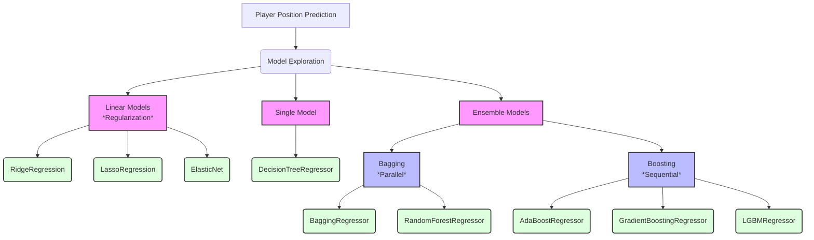

# Predicting Player Landing Spots in the NFL Big Data Bowl

This project explores various machine learning models to predict the future landing spot (X, Y coordinates) of specific NFL players, based on the Kaggle [NFL Big Data Bowl 2026](https://www.kaggle.com/competitions/nfl-big-data-bowl-2026-prediction) competition.

The core task is a multi-output regression problem: Given a snapshot of player tracking data, we predict the player's `x` and `y` coordinates at the moment the ball is caught or becomes uncatchable.

## Project Overview

The notebook(s) in this repository cover a complete machine learning workflow:
1.  **Data Loading:** Ingesting and combining multiple `input_*.csv` and `output_*.csv` files.
2.  **Data Preprocessing:** Standardizing play direction (a crucial step) and cleaning data.
3.  **Feature Engineering:** Creating new, insightful features from the raw data.
4.  **Model Exploration:** Training, evaluating, and comparing a wide range of tree-based ensemble models.
5.  **Submission:** Formatting the predictions for the official Kaggle submission API.

---

## Data Preprocessing & Feature Engineering

Before any model was trained, the data was carefully processed to create a robust set of features.

### 1. Play Direction Standardization
A key insight was that the `play_direction` ('left' or 'right') would confuse the model. All 'left'-moving plays were "flipped" to move 'right'. This involved inverting:
* `x` coordinates for players and the ball (`new_x = 120.0 - old_x`)
* `y` coordinates for players and the ball (`new_y = 53.3 - old_y`)
* `dir` and `o` (orientation) angles (`new_angle = (old_angle + 180) % 360`)

This allows the models to learn a single, consistent set of spatial patterns.

### 2. Feature Engineering
The following features were created to give the models more context:

* **Physical:**
    * `player_height_inches`: Converted from "F-I" (e.g., "6-1") format to inches.
    * `bmi`: Body Mass Index, calculated from `player_height` and `player_weight`.
    * `age`: Player's age at the time of the game.

* **Relational (Player-to-Ball):**
    * `vec_x_to_ball` / `vec_y_to_ball`: The x and y vector components from the player to the ball's landing spot.
    * `dist_to_ball`: The straight-line Euclidean distance to the ball's landing spot.
    * `angle_to_ball`: The angle (in NFL-standard degrees) from the player to the ball.
    * `diff_dir_ball_angle`: The smallest angle between the player's current `dir` (direction of motion) and the `angle_to_ball`. This helps the model understand if the player is moving *towards* the ball.

* **Categorical:**
    * `player_position` and `player_role` were one-hot encoded to be used as features.

## Model Exploration
    
A primary goal was to compare the performance of different model families. Relevant models were wrapped in `sklearn.multioutput.MultiOutputRegressor` to simultaneously predict both `x_output` and `y_output`.

The models investigated include:

### 1. Linear Models (Regularization)
* **`RidgeRegression` (L2):** A linear model that penalizes large coefficients to prevent overfitting.
* **`LassoRegression` (L1):** A linear model that can shrink coefficients to exactly zero, performing automatic feature selection.
* **`ElasticNet` (L1+L2):** A hybrid model that combines the strengths of both Ridge and Lasso.
  
### 2. Single Models (Baseline)
* **`DecisionTreeRegressor (DTR)`:** A single, non-linear tree model.

### 3. Bagging Ensembles (Parallel Training)
*Bagging* (Bootstrap Aggregating) trains many independent models and averages their results to reduce variance.
* **`RandomForestRegressor (RF)`:** The classic bagging ensemble.
* **`BaggingRegressor (BR)`:** A more general bagging ensemble.

### 4. Boosting Ensembles (Sequential Training)
*Boosting* builds a single, strong model by sequentially adding "weak" trees that correct the errors of the previous ones.
* **`AdaBoostRegressor (ABR)`:** Focuses on hard-to-predict samples by re-weighting the data.
* **`GradientBoostingRegressor (GBR)`:** Trains new trees to predict the errors (residuals) of the previous ones.
* **`LGBMRegressor (LightGBM)`:** A modern, high-speed, and highly accurate implementation of Gradient Boosting

## Results & Key Findings

* **Most Important Features:** Across all models, the most predictive features were consistently:
    1.  `dist_to_ball`
    2.  `x_input` / `y_input` (current position)
    3.  `num_frames_output` (how far in the future to predict)
    4.  `vec_x_to_ball` / `vec_y_to_ball`
    5.  `s` (current speed)

* **Model Performance:** The boosting algorithms, particularly `LGBMRegressor`, demonstrated the lowest Mean Squared Error (MSE) on the test set, indicating they were the most accurate and generalized the best.

* **Training Speed:**
    * `RandomForestRegressor` and `BaggingRegressor` were able to train very quickly in parallel using `n_jobs=-1`.
    * `LGBMRegressor` was significantly faster than the standard `GradientBoostingRegressor`.

## Future Work & Next Steps

### 1. Implement a Robust Validation Strategy

* **Problem:** The current model is evaluated using a single `train_test_split`. This provides a quick estimate, but the resulting Mean Squared Error (MSE) could be "lucky" or "unlucky" depending on how that one split was made.
* **Solution:** Implement **K-Fold Cross-Validation** (with K=5 or K=10).
    * This technique involves splitting the training data into K folds, then training and testing the model K times.
    * The **average** of the K MSE scores will provide a much more stable and reliable measure of the model's true performance on unseen data. This is essential before starting any serious hyperparameter tuning.

### 2. Hyperparameter Tuning

* **Problem:** All models are currently using their default parameters (e.g., `n_estimators=100`). These are almost never the optimal settings for a specific dataset.
* **Solution:** Use `RandomizedSearchCV` to find the best-performing hyperparameters for the top 2-3 "champion" models (e.g., `LGBMRegressor`, `ElasticNet`, `RandomForestRegressor`).
    * `RandomizedSearchCV` is much faster than `GridSearchCV` and often finds equally good (or better) models by intelligently sampling from a range of possible parameter values.
    * This search should be run using the K-Fold Cross-Validation strategy (`cv=5`) to find the parameters that perform the best on average.

### 3. Iterative Feature Engineering
* **Problem:** The current features are good, but may be missing key interactions.
* **Solution:** Based on the Error Analysis, create new features to address the model's weaknesses.
    * **Example:** If the model struggles with players who are far away *and* moving fast, an **interaction feature** like `dist_speed_interaction = dist_to_ball * s` could be highly predictive.

##  How to Run
This project is contained within `[Your-Notebook-Name.ipynb]`.
1.  Ensure you have the required libraries: `pandas`, `numpy`, `sklearn`, `matplotlib`, and `lightgbm`.
2.  Run the notebook cells sequentially from top to bottom.
3.  The final cells, containing the `predict()` function and `NFLInferenceServer`, are set up to run the submission process via the Kaggle API.

## GenAI acknowledgment
Portions of this project were developed with the assistance of Gemini 2.5 Pro, a large language model developed by Google.
Its capabilities were utilized for:
* Conceptual brainstorming and exploring different modeling approaches (e.g., comparing Bagging, Boosting, and Linear Models).
* Generating, debugging, and refactoring code snippets for data preprocessing and model training pipelines.
* Drafting and refining documentation, including explanatory text and sections of this README file.
* All AI-generated outputs were reviewed, validated, and adapted by the author to fit the specific goals of this analysis.
